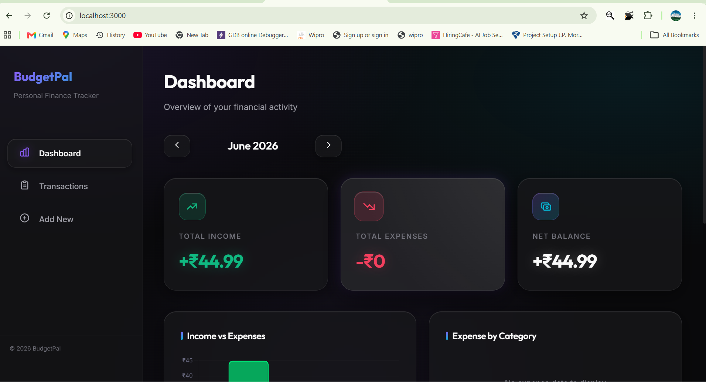
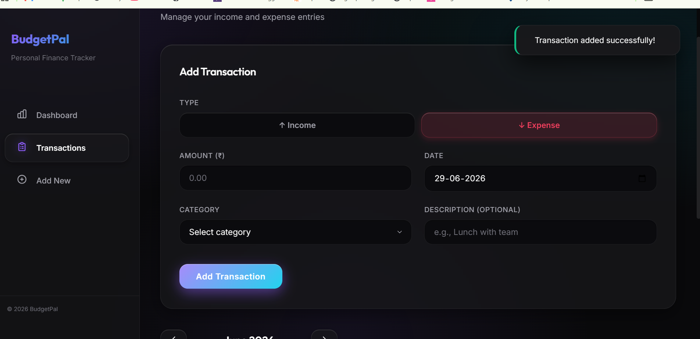
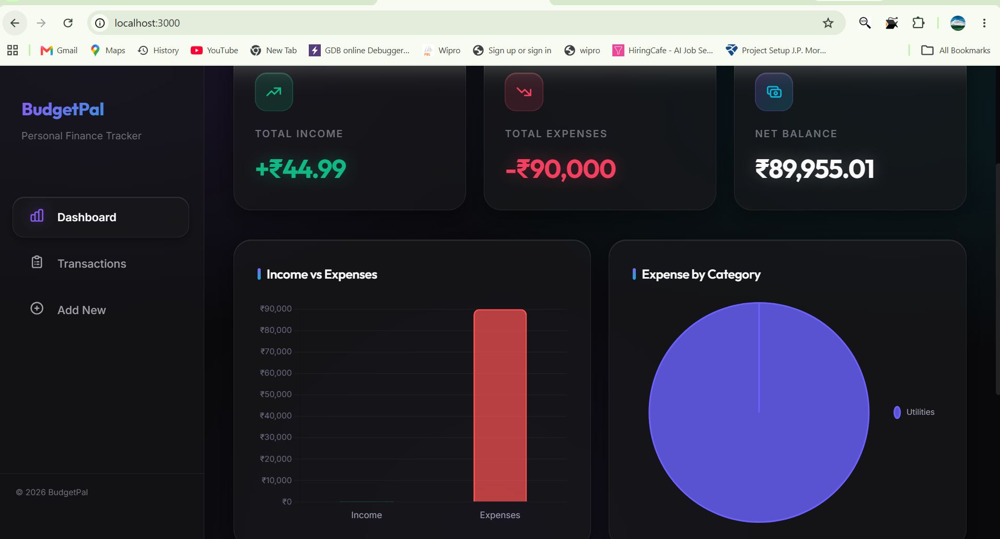
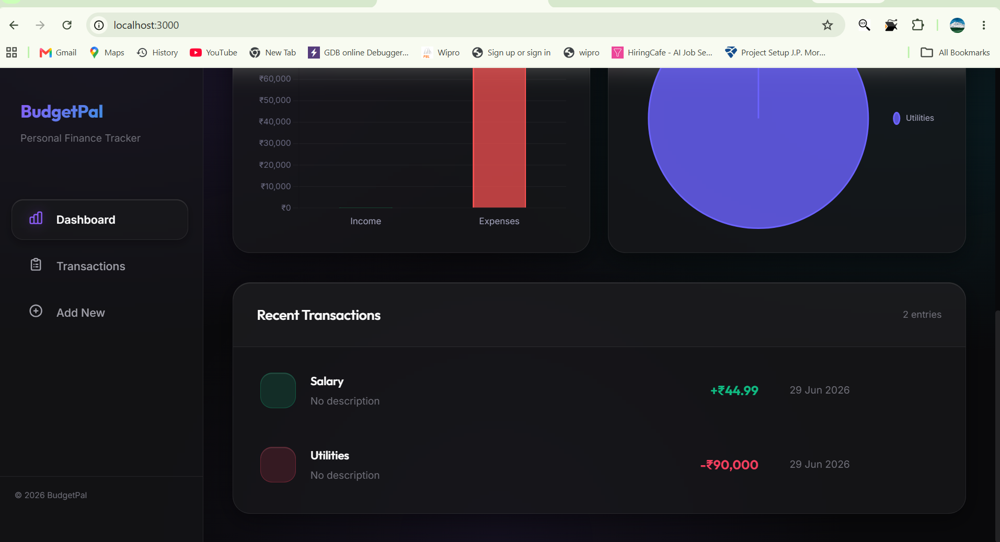

#  BudgetPal – Personal Budget Tracker

A full-stack **MERN** (MongoDB, Express, React, Node.js) web application for individuals and small businesses to track daily income & expenses, visualize spending patterns with interactive charts, and manage personal finances effortlessly.

---

##  Features

- ** Dashboard** – Monthly overview with income, expenses, and net balance summary cards
- ** Interactive Charts** – Bar chart (income vs expenses) and Pie chart (category breakdown) powered by Chart.js
- ** Add Transactions** – Quick entry form with type toggle (income/expense), category picker, and date selection
- **️ Edit & Delete** – Full CRUD operations on all transactions
- **️ Month Navigation** – Browse through months to view historical data
- ** Fully Responsive** – Works seamlessly on mobile, tablet, and desktop
- ** Premium Dark UI** – Modern dark theme with glassmorphism, gradients, and smooth animations
- ** Toast Notifications** – Real-time feedback for all actions
- **️ Smart Categories** – Pre-defined income and expense categories with emoji icons

---

##  Tech Stack

| Layer          | Technology                          |
| -------------- | ----------------------------------- |
| **Frontend**   | React 19, Vite, react-router-dom v7 |
| **Charts**     | Chart.js + react-chartjs-2         |
| **Styling**    | Vanilla CSS (custom design system) |
| **Backend**    | Node.js, Express 5                 |
| **Database**   | SQLite (Sequelize ORM)             |
| **HTTP Client**| Axios                              |
| **Icons**      | react-icons (Heroicons)            |

---

##  Project Structure

```
personal-budget-tracker/
├── client/                    # React frontend
│   ├── public/                # Static assets
│   ├── src/
│   │   ├── components/        # Reusable UI components
│   │   │   ├── Charts.jsx     # Bar and Pie chart components
│   │   │   ├── ConfirmModal.jsx
│   │   │   ├── MonthPicker.jsx
│   │   │   ├── Sidebar.jsx
│   │   │   ├── SummaryCards.jsx
│   │   │   ├── Toast.jsx
│   │   │   ├── TransactionForm.jsx
│   │   │   ├── TransactionList.jsx
│   │   │   └── TypeFilter.jsx
│   │   ├── pages/             # Page-level components
│   │   │   ├── AddTransaction.jsx
│   │   │   ├── Dashboard.jsx
│   │   │   └── Transactions.jsx
│   │   ├── services/          # API service layer
│   │   │   └── api.js
│   │   ├── utils/             # Constants and helpers
│   │   │   └── constants.js
│   │   ├── App.jsx            # Root component with routing
│   │   ├── index.css          # Complete design system
│   │   └── main.jsx           # Entry point
│   ├── index.html
│   ├── vite.config.js
│   └── package.json
├── server/                    # Express backend
│   ├── models/
│   │   └── Transaction.js     # Sequelize model
│   ├── routes/
│   │   └── transactions.js    # CRUD API routes
│   ├── server.js              # Express app entry
│   ├── .env.example           # Environment variables template
│   └── package.json
├── .gitignore
└── README.md
```

---

##  Getting Started

### Prerequisites

- **Node.js** >= 18.x
- **npm** or **yarn**

### 1. Clone the Repository

```bash
git clone https://github.com/Raghu1611/personal-budget-tracker.git
cd personal-budget-tracker
```

### 2. Set Up the Backend

```bash
cd server
npm install

# Create environment file
cp .env.example .env
# Edit .env if needed

# Start the backend server
npm run dev
```

The server will start on `http://localhost:5000`.

### 3. Set Up the Frontend

```bash
cd client
npm install

# Start the React dev server
npm run dev
```

The app will open at `http://localhost:3000`.

---

##  API Endpoints

| Method   | Endpoint                    | Description                              |
| -------- | --------------------------- | ---------------------------------------- |
| `GET`    | `/api/transactions`         | Get all transactions (with filters)      |
| `GET`    | `/api/transactions/summary` | Get monthly income/expense summary       |
| `GET`    | `/api/transactions/:id`     | Get a single transaction                 |
| `POST`   | `/api/transactions`         | Create a new transaction                 |
| `PUT`    | `/api/transactions/:id`     | Update an existing transaction           |
| `DELETE` | `/api/transactions/:id`     | Delete a transaction                     |
| `GET`    | `/api/health`               | Health check endpoint                    |

### Query Parameters

- `month` – Filter by month (1-12)
- `year` – Filter by year
- `type` – Filter by type (`income` or `expense`)

---

##  Screenshots


<br />

<br />

<br />


##  Design Highlights

- **Dark Theme** with carefully chosen color palette (purple-cyan accents)
- **Glassmorphism** effects with subtle backdrop blurs
- **Smooth Animations** – fade-in, slide-up, staggered list animations
- **Responsive Grid** – adapts from 3-column desktop to single-column mobile
- **Custom Scrollbar** styled to match the theme
- **Premium Typography** using Inter font family

---

##  License

This project is licensed under the MIT License.

---

##  Author

**Raghu** – [GitHub](https://github.com/Raghu1611)

---

> Built as part of the **Azentrix Digital Services Summer Internship Program 2026**.
